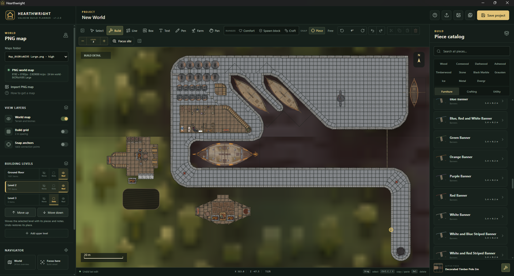
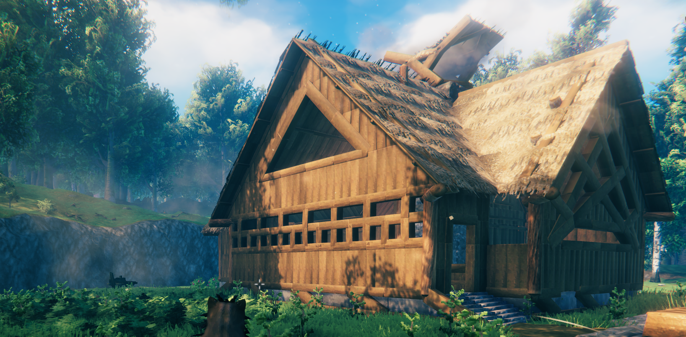
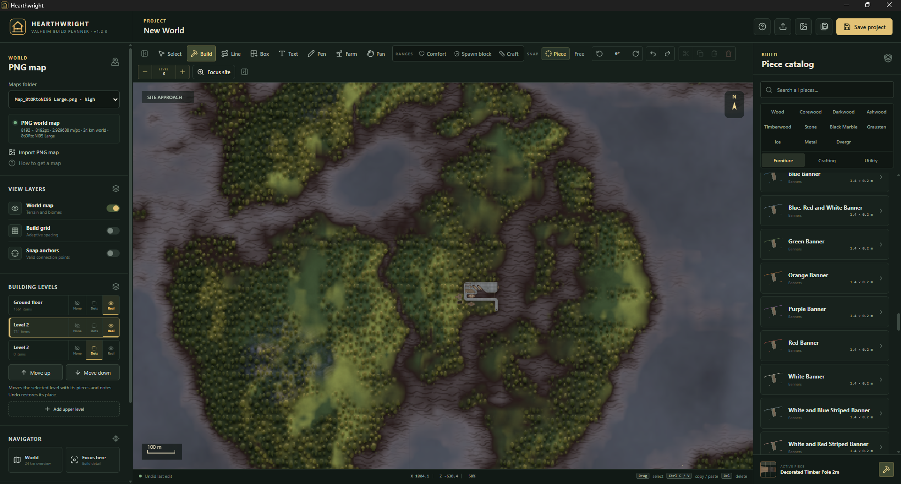

  

# Hearthwright

**Plan your next Valheim build before spending the materials.**

Hearthwright is a free, standalone Windows planner for laying out buildings, workshops, farms, and settlements. Work on a blank canvas or import a PNG of your world, choose a site, and arrange build pieces at game scale.

**Hearthwright 1.2.2 · Windows x64 · 397 build pieces · Valheim 1.0.7 catalog**

**Build-piece spoilers:** The catalog includes the new pieces from Valheim 1.0, including materials and parts you may not have discovered in-game yet.

[Quick start](docs/quick-start.md) · [Controls](docs/controls.md) · [Piece catalog](docs/catalog.md) · [Download help](docs/download-help.md)

## Download and start planning

**[Download Hearthwright 1.2.2 for Windows](https://github.com/Grackley/HearthWright/releases/download/v1.2.2/Hearthwright-Portable-1.2.2.exe)** · [Release notes](https://github.com/Grackley/HearthWright/releases/tag/v1.2.2)

> **Windows download notice:** Hearthwright is currently unsigned. Microsoft Edge or Windows may show **“not commonly downloaded”** or **“Publisher: Unknown.”** These are reputation and publisher warnings; they do not, by themselves, mean malware was detected. Use the download link above. [Read about the warning](docs/download-help.md#windows-download-warning).

Download `Hearthwright-Portable-1.2.2.exe` and open it. It is the complete Windows app; no installer, PowerShell commands, or developer tools are needed. The header should show **v1.2.2**. GitHub's **Code → Download ZIP** contains the source code for developers.

The first launch includes a centered walkthrough. Replay it from **? Getting started → Start guided walkthrough** whenever you need a refresher.

To start fresh, choose **New project** at the top. It offers to save your current work, then opens a blank grid with one ground-floor level. Importing a map is optional, and your saved projects and map library stay available.

## A plan and the build it represents

A harbor layout in Hearthwright, with room for ships, workshops, and buildings across multiple levels:

One of the matching buildings in Valheim. This is an in-game screenshot, not a 3D preview generated by Hearthwright:

See the same plan in its world-map setting

## What you can plan

- **Buildings and roofs:** browse 397 pieces by material, including Timberwood, Scalewood walls, Ice, drawbridges, and 67° roofs and supports. Place individual pieces, aligned lines, or filled rectangles.
- **Multiple floors:** add, reorder, hide, or outline building levels while keeping their contents together.
- **Workshops and comfortable homes:** inspect crafting requirements, comfort values, station connections, and range overlays.
- **Material collection:** select pieces on a building level to see their combined material totals. Move and rotate selected pieces as a group.
- **Farms and settlements:** mark cultivated areas, add notes and drawings, and plan around your imported world map.
- **Projects you can revisit:** save editable `.hearthwright` files or export a PNG to share your plan.

All build pieces are available, including late-game and seasonal pieces. The planner does not simulate structural strength or construct buildings inside Valheim.

## Your maps and projects stay local

Maps are optional, user-provided PNGs. Hearthwright does not upload your maps or plans, and no personal world map is bundled with the app. It does not edit Valheim world saves.

For a world image, see the [map export instructions](docs/quick-start.md#bring-in-your-world-map) for the independent [Valheim World Generator](https://valheim-map.world/).

**Map support:** As of September 9, 2026, the map generator reports that Valheim 1.0 is not yet supported. Hearthwright's 1.0 piece catalog is available; you can plan without a map or use an existing compatible full-world PNG while waiting for the generator update. Check the generator's current notice before exporting a new map.

## Feedback

Use [Issues](https://github.com/Grackley/HearthWright/issues) for bugs and focused feature requests, or [Discussions](https://github.com/Grackley/HearthWright/discussions) for questions and shared plans. For a bug report, include your app version, what you expected, and the steps needed to reproduce the problem.

## For developers

The [contribution guidance](CONTRIBUTING.md) and [development setup](docs/development.md) are for people who want to work on Hearthwright's code. They are not setup steps for using the downloaded app. The public source uses schematic piece shapes unless a separate local visual bundle is available; the portable download already includes the previews and piece data.

This source repository starts with the 1.2.0 community release. See the [changelog](CHANGELOG.md).

Map calibration was corrected in 1.2.1. New and saved plans use the corrected scale automatically. See [map calibration details](docs/map-scale.md).

## Credits and licensing

Hearthwright is an unofficial fan project, unaffiliated with Iron Gate AB or Coffee Stain Publishing. Valheim and its game content belong to their respective owners.

Hearthwright's original code uses the [MIT license](LICENSE). That license does not cover Valheim artwork, documentation screenshots containing game content, or user-provided maps. Raw game files and extracted asset bundles are excluded from this source repository. See [third-party notices](THIRD_PARTY_NOTICES.md).
